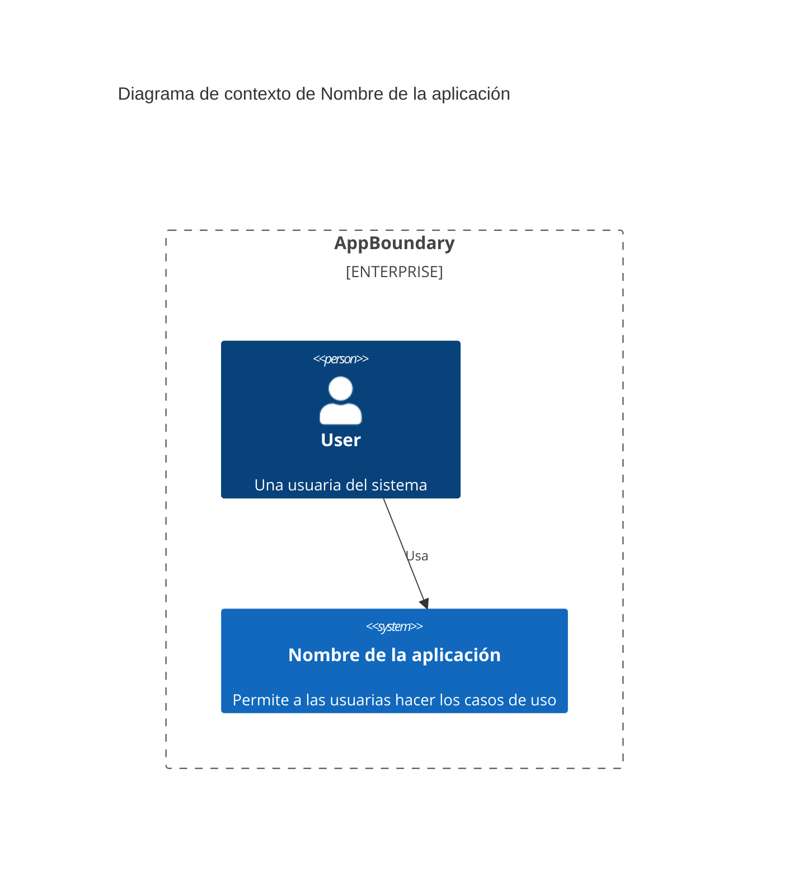
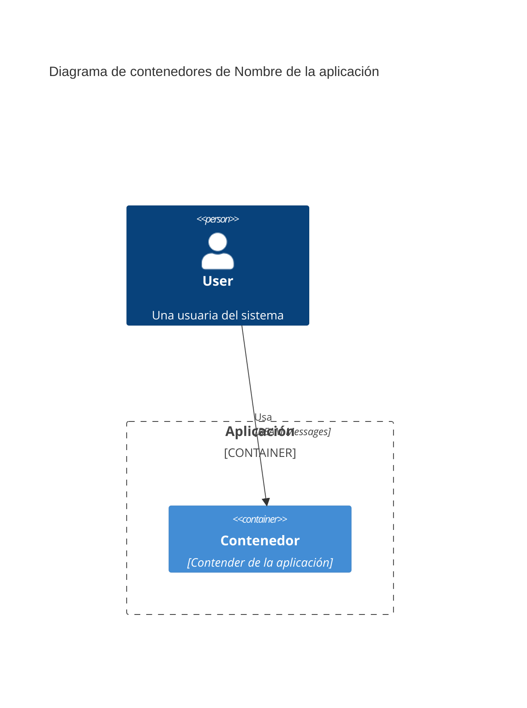

# Nombre del proyecto

## Descripción de la aplicación

Breve descripción del sistema desarrollado, así como los requisitos
funcionales y no funcionales del mismo, y cualquier otra información
que contribuya a una mejor comprensión del mismo.

## Requisitos funcionales

## Requisitos no funcionales

## Propuesta de arquitectura

Diseño de la arquitectura propuesta siguiendo el modelo C4, niveles 1
y 2.

