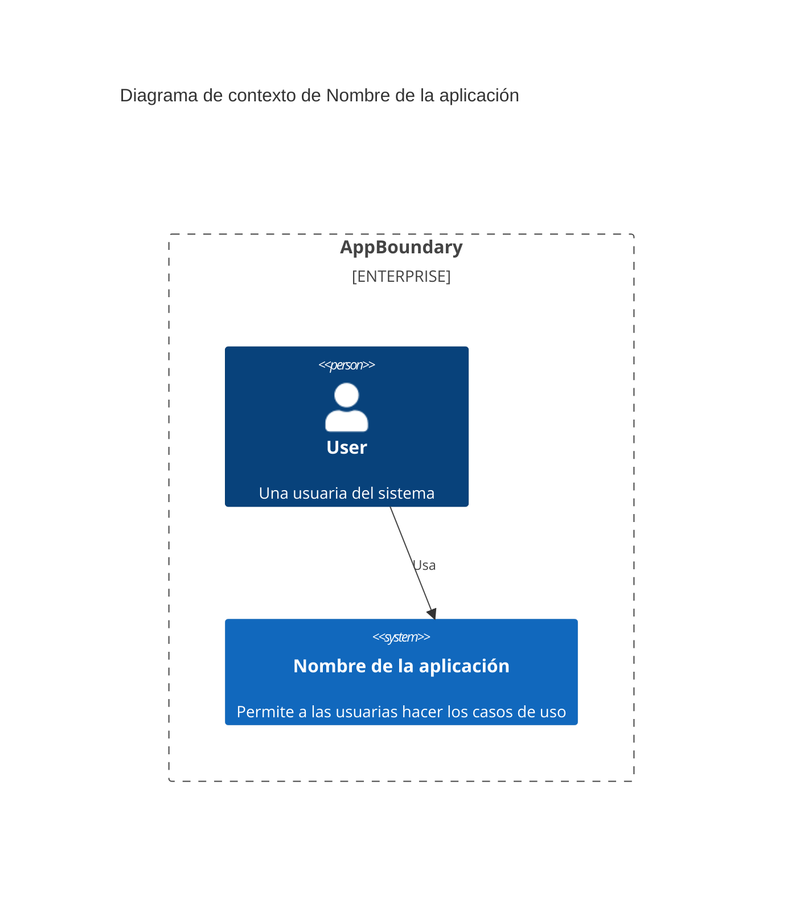
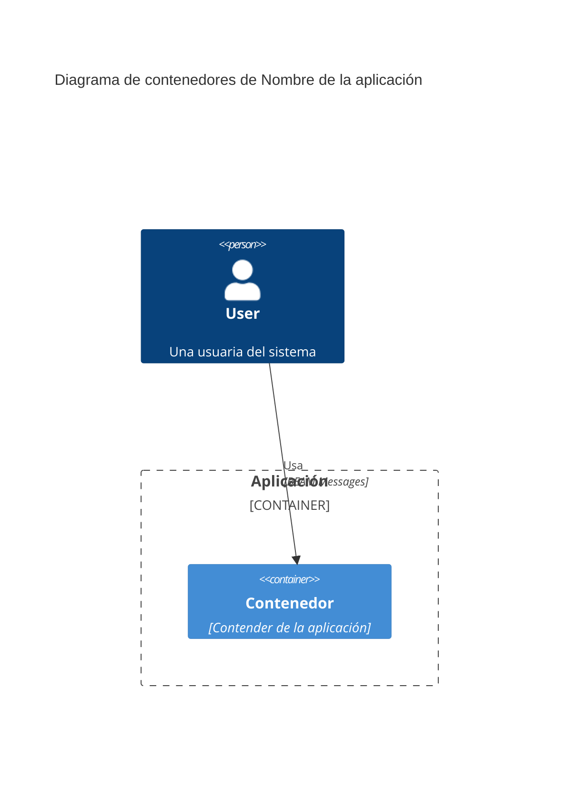

# Plantilla de Propuesta

(Seguid esta estructura para vuestro primer documento)

[Nombre del Proyecto]

- Descripción: Un párrafo que explique la esencia del sistema.

- Funciones principales: Listado de lo que el usuario puede hacer (requisitos funcionales).

- Atributos de calidad: ¿Qué hace que este sistema sea "bueno"?
  (Rendimiento, tolerancia a fallos, etc.), (requisitos no
  funcionales).

- Arquitectura Inicial: (Insertad aquí vuestros diagramas de Contexto
  y Contenedores usando Mermaid).
	
	

```mermaid
C4Context
  title Diagrama de contexto de Nombre de la aplicación
  
  Enterprise_Boundary(b0, "AppBoundary") {
    Person(user, "User", "Una usuaria del sistema")
	
	System(system, "Nombre de la aplicación", "Permite a las usuarias hacer los casos de uso")
	
	Rel(user, system, "Usa")
}
``` 

```mermaid
C4Container
  title Diagrama de contenedores de Nombre de la aplicación
  
  Person(user, "User", "Una usuaria del sistema")
  
  Container_Boundary(c1, "Aplicación") {
    Container(container, "Contenedor", "Contender de la aplicación")
  }
  
  Rel(user, container, "Usa", "BEAM Messages")
```

